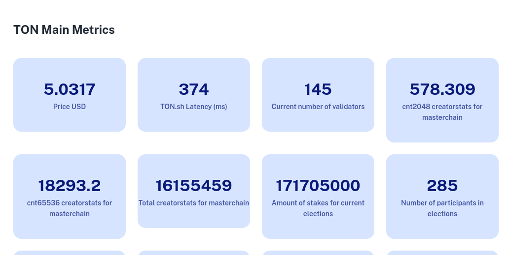

# Tonometer.xyz TON status page



The data is collected on a home server where a light client of the TON network is assembled. Lite client requests data about the system and puts it in the InfluxDB database. The server part written in nodejs, it reads the prepared data from InfuxDB and shows is the browser by the client part written in javascript react.

[Frontend Contest: TON status page, Stage 1](https://github.com/newton-blockchain/TIPs/issues/43)

Task:
Create a web app and corresponding open-source backend, which display summarized data on the state and availability of TON Blockchain.

In particular, the page should display:

- Performance and block rate of TON chains: masterchain and basechain (note that there may be more than one shard on basechain)
- Performance and responsiveness of primary TON services: ton.org, ton.sh, toncenter.com
- TON/ETH and TON/BSC bridge operability status
- Status of main on-chain governance activity: validator elections, config votings, slashing.
- Public liteservers performance: response time and sync state
- Public DHT-servers performance
- Basic on-chain stats: tps, accounts activity, transferred amount by type, number of validators

API and integration with notification services (Telegram channel/bot) will increase your chances to win.

# Demo
The demo is available [here](https://tonometer.xyz).

# Development
```shell
cd ./backend
yarn install
yarn start
```

# Build Production Release
```shell
cd ./frontend
yarn install
yarn build
```

This project was made just for fun to get familiar with the platform. 
It should not be used for making the trading decisions. Author is not responsible for any financial loss.
some data sown on the pages can be outdated, some even could be still mocked.

-React Material Design set of components for the UI
- React
- InfluxDB Time series database ideal for data storing.
- stream.io
- Tonmon set of scrips to parse and store lite client response.

# Further development
- create a chat boat and robot for notifications
- allow websockets for socket.io
- load price trough another api, ton.sh seems returns always the same
- add more servers to harvest the data, right now big part of it works on my local computer.
- setup proper deployment strategy using apache-modproxy and forever is questionable solution, 
- nginx on top of cybernetes cluster would be more stable.

Deployment
forever

# Architecture
- frontend - react js app
- backend - nodejs app
- importer - scripts to import global data
- tomnon - scripts to import lite client output (modified version of tonmon made to work with influxdb instead if the original one.)

# Data Harvesting
CQRS approach allows scaling app very easily. The different parts of the app can be geographically distributed which makes the final result even more precise. 
The components of the system are communicating together writing and reading data to influxdb database.
The UI panel is simple React Js App on top of node.js api, which used Influxdb for data aggregation. 
There is also a possibility to show data in grafana.
Since the data collection and visualisation are separated it makes the app really fast.
